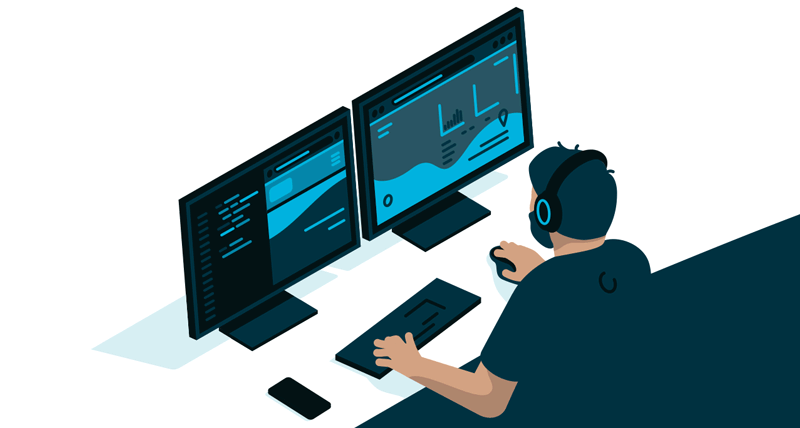

# Hi there, I'm Punit 👋

## Welcome to my GitHub Profile!

I'm a passionate MERN Stack developer with expertise in MongoDB, Express.js, React.js, and Node.js. I specialize in creating seamless user experiences, whether it’s building dynamic web applications or crafting robust mobile apps using React Native. My code is a blend of creativity, efficiency, and clean architecture.

- 🌱 I’m currently expanding my portfolio with a variety of projects. 
- 📖 I’m currently learning more about advanced React patterns, backend architecture and react-native development.
- 👯 I’m looking to collaborate on open-source projects and innovative startup ideas.
- 🤔 I’m looking for help with diving deeper into cloud technologies.
- 🔍 Feel free to explore my repositories and connect with me! 
- 📫 How to reach me: punitshinde1@gmail.com

## 🌐 Languages and Frameworks

### 💻 Front-End:

### 🖥 Back-End:

### 📱 Mobile Development:

### 🛠 Tools & Technologies

### 🎨 UI/UX Design

#### Design Tools:

### 👩‍💻 Programming Languages:

### 💼 Productivity Tools

#### Skills:
- Wireframing and Prototyping
- User Research and Testing
- Information Architecture
- Visual Design and Branding
- Image/Video Editing
- Responsive Design Principles
- Accessibility Standards

## 📫 Connect with Me:

#### 🚀 Let's collaborate and innovate together! I'm eager to connect with individuals who share my passion for technology, design, and making a positive impact. Feel free to reach out via email 📩, and let's turn our ideas into reality! 💡

